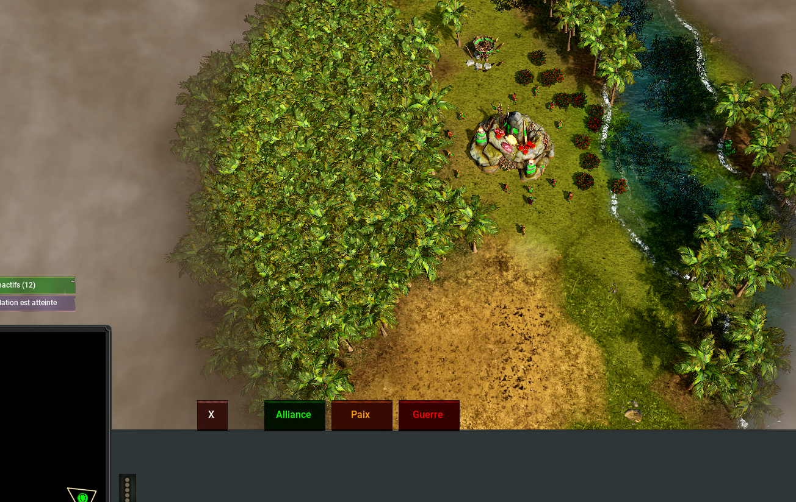

# Diplomacy
**Status:** Stable

## Mod IDs

This mod is made of 3 scripts — each one has its own in-game ID. **Add all three to your map** for the mod to work.

| Script | Mod ID |
|--------|--------|
| `diplomacy_interface.lua` | **`mod-s2u4EUGfise`** |
| `gameplay_backend.lua` | **`mod-HmXZrJBjwM6`** |
| `ui_framework.lua` | **`mod-KbwSsR2og7a`** |

> [!TIP]
> **The quickest way to use this mod — no code to copy.** Open your map in the editor → **Mods** → **Add a modification**, and add each of the 3 IDs above. Save and publish the map. Full instructions: [Add an existing mod to your map](../../docs/modding-guide/installation.md#part-3--add-an-existing-already-published-mod-to-your-map).

## What does this mod do?

This mod adds **player-to-player diplomacy** to Wars Selection. It adds **3 new buttons** in the match interface:

1. **Alliance** — send an alliance request to another player
2. **Peace** — declare yourself neutral with a player (sign peace)
3. **War** — declare a player your enemy

To use a button, click it and then click on the territory of the player you want to target. Alliance and peace requests are **proposals**: the other player gets **Accept** / **Refuse** buttons (a request expires after 10 seconds), while a war declaration takes effect immediately. Every diplomatic event is announced to all players on screen, with sounds.

The mod also adds a **shared victory condition**: when every surviving player is allied with each other, the match ends and they win together.

Extra rules built in:

- You need **at least 3 living players** in the match to form an alliance
- Each player can have **at most 5 allies** (changeable in the code)
- You cannot target your own faction or empty territory

## Quick install
This mod is made of **3 script files that work together** — create three mods in the game's **map editor** (e.g. "Diplomacy UI", "Diplomacy Interface", "Diplomacy Gameplay"), one per file, and add all three to your map.

1. Download the 3 `.lua` files (`ui_framework.lua`, `diplomacy_interface.lua`, `gameplay_backend.lua`) from this folder.
2. Create the mods in the game's **map editor**: open the editor, go to **Mods** → **My mods** → **+**, give each mod a name and a description, then add them to your map.
3. Start a **private match** on your map with **developer mode** enabled, open each mod, and paste the matching code with **Edit script**.
4. Relaunch the map — the diplomacy menu appears next to the minimap.

Full walkthrough: [docs/modding-guide/installation.md](../../docs/modding-guide/installation.md)

If you prefer, use the **3 Mod IDs** at the top of this page to add the scripts directly, without copying any code.

## Settings

No in-game settings panel. Two constants can be changed at the top of `diplomacy_interface.lua`:

| Constant | Default | What it does |
|----------|---------|--------------|
| `TEST_MODE` | `false` | When `true`, relaxes the checks (ally with anyone, test on your own territory) — for testing only |
| `MAX_ALLIES` | `5` | Maximum number of allies a player (and a target) can have |

## How it works (for modders)

- `ui_framework.lua` (originally `Alliance.lua`) — a reusable **UI widget library** (Interface/Widget/Panel/Image/Label classes, hotkey binding, sound helpers) for building custom interfaces.
- `diplomacy_interface.lua` (originally `Alliance_deuxieme.lua`) — the **frontend**. Creates a `diplomacyInterface` via `addInterface("diplomacyInterface", "/project/Tools/placingButtons", ...)`, then reuses native interface nodes every 10 ticks to draw the button menu (nodes 18, 12–16) and the three notification tracks (global announcement, system message, interaction request). Button clicks arrive through `onSpecialCommand` (`placerButton`); accepted requests are sent to the backend with `f_specialCommand(0, "command", "Diplomacy", ...)`.
- `gameplay_backend.lua` (originally `Gameplay_alliance.lua`) — the **backend**. Maps players to factions (`getFactionOfPlayer` / `getPlayerOfFaction`), sets relations both ways with `root.scene[0].relation.f_set` (1 = ally, 2 = war, 3 = peace), handles the `Diplomacy` command, and runs the shared-victory check once per second (`winControlDiplomacy`) — when all living players are mutual allies, everyone is eliminated with the win flag and the match finishes.

## Known issues / notes

- All in-game messages and button labels are in English.
- Diplomatic actions only work by clicking on a player's territory — not on neutral ground.
- The notification system reuses native interface nodes; other interface mods touching the same nodes could conflict.
